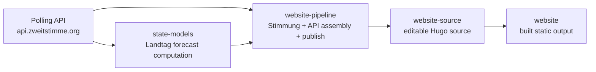

# Zweitstimme.org Website Pipeline

Automated data pipeline for [zweitstimme.org](https://zweitstimme.org): server-side **Aktuelle Stimmung** (Kalman filter), election calendar, state/federal forecasts, and JSON publication to the Hugo website repo.

## Architecture

This repo is the **integration and publishing layer**. Forecast computation lives in `state-models`; the live site is a built artifact.



The website still fetches **live polls** from the API for poll tables and scatter dots. Kalman **Stimmung** runs here; Landtag **forecasts** are computed in [state-models](https://github.com/zweitstimme-org/state-models) and published from this pipeline.

## Repo boundaries

### Responsibility split

- **`state-models`** computes Landtag forecasts and posterior draws
- **`website-pipeline`** runs Stimmung, assembles the Forecast API, prepares website JSON, and publishes to preview/live
- **`website-source`** is the editable Hugo source repo
- **`website`** is the built static site served by GitHub Pages

### Poll-driven refresh policy

By default, forecast-like workflows should only refresh when there is a **newer poll than the one already published**.

- `Daily Stimmung` should not republish just because the day changed
- `State Forecasts` should not bump `Stand` unless a newer included poll exists
- manual workflow runs can override this with `force_refresh=true`

This keeps published `Stand` timestamps tied to meaningful upstream polling changes rather than routine scheduler noise.

## Quick start

```bash
# Install dependencies
make deps

# Scrape election dates + compute Stimmung for Bundestag + 16 states
make stimmung

# Inspect outputs
make status
ls output/
```

Outputs land in `output/`:

| File | Description |
|------|-------------|
| `stimmung_federal.json` | Daily Kalman series (filtered + smoothed) for Bundestag |
| `stimmung_states.json` | Same for all 16 Länder |
| `current_stimmung.json` | Latest values + trends |
| `election_calendar.json` | Upcoming federal + state elections |
| `display_mode.json` | Whether to show forecast or Stimmung per scope; `archive.forecasts` lists homepage archive runs (7 days after election) |
| `forecast_state_*.json` | State model forecasts (within 90 days of election) |
| `archive/forecast_*.json` | Frozen pre-election forecasts after election day |
| `forecast_federal.json` | Zweitstimme federal forecast (when wired) |

## R pipeline (`R/`)

| Script | Role |
|--------|------|
| `install.R` | Install `jsonlite`, `httr`, `lubridate` (+ optional `rstanarm` for state model) |
| `config.R` | API URL, scopes, Kalman parameters |
| `party_mapper.R` | Party normalization (mirrors website JS) |
| `fetch_polls.R` | Paginated fetch from `/v2/polls` |
| `kalman.R` | 1D random-walk Kalman filter + RTS smoother |
| `run_stimmung.R` | Main orchestrator |
| `display_mode.R` | Election calendar, 90-day forecast window, homepage archive for 7 days after election |

Each Stimmung run **estimates** Kalman `q` (process) and `r` (measurement) from the polls for that scope via `calibrate_kalman_qr()` in `R/kalman.R`: on consecutive days with observations, regress squared differences of daily party means on day gap and `1/n_i+1/n_j` (`E[(ȳ_j−ȳ_i)²] = q·gap + r·(1/n_i+1/n_j)`), matching the filter’s daily-mean observation model. Fallbacks (`q=0.1`/`r=1.0` federal, `q=0.05`/`r=1.5` states) apply when pairs are too few or an estimate is non-positive; disable with `CALIBRATE_KALMAN=false`. Estimated values are written into JSON metadata. The pipeline uses the **RTS smoother** for historical curves; the headline current value uses the last smoothed point (identical to the filtered estimate at the final time step).

### Time-varying party inclusion

Pollsters differ in which parties they list, and parties enter/leave the polled
universe over time (BSW from 2024, FDP dropped in some Länder). The pipeline
therefore computes a per-day **activity mask** for every party
(`party_activity_masks` in `R/kalman.R`): the reference window is all polls of
the trailing 90 days, extended to at least the last 5 polls. A party becomes
active at ≥40% presence in the window, exits below 10% (sparse windows only
after a 30-day grace period without any listing), and keeps its previous state
in between (hysteresis). Outside its active window a party's series/current
value is `null` and its share flows into **Sonstige**, which is always computed
as the residual to 100% over the active parties. This prevents Sonstige from
jumping when an institute stops listing a party, removes backfill before a
party existed, and stops stale values from lingering after pollsters drop a
party.

Environment variables:

| Variable | Default | Purpose |
|----------|---------|---------|
| `POLLING_API_BASE` | `https://api.zweitstimme.org` | API base URL |
| `USE_SMOOTHER` | `true` | Use RTS smoother for display series |
| `STIMMUNG_HISTORY_DAYS` | `3650` | History depth |
| `FORECAST_WINDOW_DAYS` | `90` | Days before election to serve forecasts |
| `FORECAST_ARCHIVE_DAYS` | `7` | Days after election to keep the last forecast on the homepage archive |
| `FEDERAL_ELECTION_DATE` | `2029-02-25` | Next Bundestagswahl (manual until API has dates) |
| `PARTY_ACTIVITY_WINDOW_DAYS` | `90` | Trailing window for party activity |
| `PARTY_ACTIVITY_MIN_K` | `5` | Minimum polls in the activity window |
| `PARTY_ACTIVITY_ENTER_FRAC` | `0.4` | Presence share to become active |
| `PARTY_ACTIVITY_EXIT_FRAC` | `0.1` | Presence share below which a party exits |
| `PARTY_ACTIVITY_EXIT_GRACE_DAYS` | `30` | Grace before exit in sparse windows |

## State forecasts (`state-model/` + `state-models`)

Uses [state-models](https://github.com/zweitstimme-org/state-models) with **exact lead days** (election − today) and **polls-only** models (same as BW/RP 2026). No `new_party` indicator; not the paper’s fixed 2/14/60-day buckets.

```bash
# Sibling clone (CI does this automatically)
git clone https://github.com/zweitstimme-org/state-models.git ../state-models

# All elections in the 90-day window, or one state:
make state-forecast
make state-forecast STATE=ST DATE=2026-09-06

# Reuse cached Stan fits when lead days unchanged:
SKIP_ESTIMATE=1 make state-forecast
```

- `scripts/run_state_models_forecast.sh` — runs `state-models` `run_pipeline.R`, converts to website JSON, then rebuilds district + parliament-size outputs (`SKIP_DISTRICTS=1` to skip)
- `state-model/convert_fcst_to_json.R` — `fcst_state.Rdata` → `output/forecast_state_*.json` (+ website scenarios)

## Federal forecast (`federal-model/`)

Skeleton for the [prediction-2025](https://github.com/zweitstimme-org/prediction-2025) Zweitstimme model. Full MCMC runs require the self-hosted runner (~21 h). District forecast inputs (candidates, GeoJSON, remapping) go in `federal-model/inputs/`.

## Website integration (`website-integration/`)

Patches for [website-source](https://github.com/zweitstimme-org/website-source) (Hugo source). The live site [zweitstimme.org](https://zweitstimme.org) is the built output in [website](https://github.com/zweitstimme-org/website) (GitHub Pages, `main`).

- `static/js/pipeline-data.js` — loads pipeline JSON in the browser
- `themes/PaperMod/layouts/partials/home_info_de.html` — dedicated **Vorhersage** section (active forecasts) and **Archiv – Vorhersagen** (post-election), included at Hugo build time from `data/display_mode.json` so empty blocks (and their background stripes) are omitted; Bundestag/Landtage sections show Kalman Stimmung only
- Wahlkreise (`/direktmandate/`), Einzugschancen (`/einzug/`) and candidate profiles (`/kandidat/`) publish to the live site; Wahlabend-Nowcast (`preview/wahlabend/`) stays on the Pages mock only
- `.github/workflows/deploy.yml` — Hugo build from repo root → deploy to `zweitstimme-org/website` (`cname: zweitstimme.org`)

`scripts/publish_to_website.sh` copies data JSON + integration files to `website-source` and pushes (triggers the deploy workflow). Requires `WEBSITE_DEPLOY_TOKEN` with write access to both `website-source` and `website`.

## GitHub Actions

| Workflow | Runner | Schedule | Publishes to |
|----------|--------|----------|--------------|
| `.github/workflows/stimmung.yml` | `ubuntu-latest` | Daily 06:00 UTC | [Pages preview](https://zweitstimme-org.github.io/website-pipeline/) `data/` (+ website-source if token set) |
| `.github/workflows/state-forecast.yml` | `ubuntu-latest` | Daily 07:30 UTC | same |
| `.github/workflows/federal-forecast.yml` | `ubuntu-latest` | Weekly + manual | artifacts only for now |
| `.github/workflows/deploy-pages.yml` | `ubuntu-latest` | on `gh-pages` push | GitHub Pages site |

While production deploy is optional, **CI already refreshes the Pages preview**: after each eligible Stimmung / state-forecast run, `scripts/publish_to_pages_preview.sh` updates `gh-pages` `data/*.json`, which triggers `deploy-pages.yml`. The workflows are poll-gated by default, so scheduled runs skip if no newer poll is available unless manually forced. Full Hugo rebuilds still use `./scripts/deploy_pages_preview.sh` locally.

### Secrets

| Secret | Purpose |
|--------|---------|
| `GITHUB_TOKEN` | Built-in; used to push preview data to `gh-pages` (`contents: write`) |
| `WEBSITE_DEPLOY_TOKEN` | Optional PAT with write access to `zweitstimme-org/website-source` |
| `STATE_MODELS_TOKEN` | Optional. `zweitstimme-org/state-models` is public; CI can clone it without a PAT. Keep a token only if you pin a private fork. |

### Self-hosted runner setup

See [docs/RUNNER_SETUP.md](docs/RUNNER_SETUP.md).

## Python utilities (`code/`)

Legacy helpers kept for election date scraping:

```bash
make election-dates   # scrape wahlrecht.de → data/json_output/election_dates.json
```

The polling API does not yet expose upcoming election dates; the scraper fills that gap until it does.

## Makefile targets

```bash
make help            # list all targets
make all             # election dates + Stimmung + display mode
make publish         # stimmung + push to website-source (needs token)
make clean           # remove output/
```

## Data maintenance

- **`data/state_fundamentals.json`** — `gov`/`pm` flags per state (update when governments change). The new-party indicator is not used in forecasts (polls capture that dynamics; see published BW/RP 2026 methodology).
- **`data/state_forecast_scenarios.json`** — coalition / largest-party / 5%-hurdle scenarios for state forecast probabilities (items under 1% are omitted from JSON output)
- **`data/state-election-results.csv`** — historical Landtag results for `voteshare_l1`
- **`FEDERAL_ELECTION_DATE`** — set when next Bundestagswahl is confirmed

## License

[Add license information]
